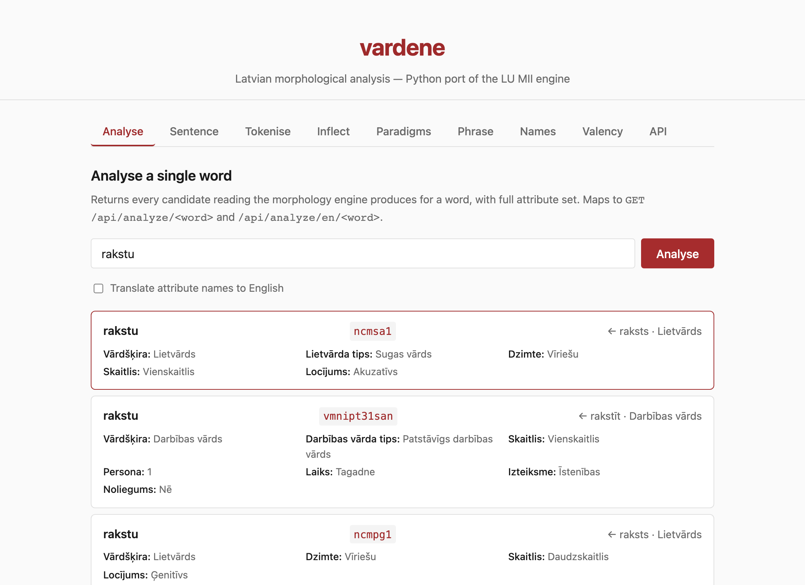
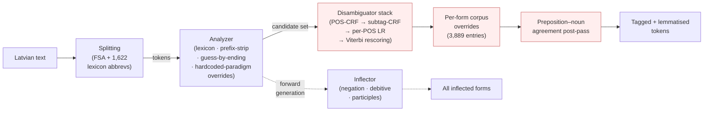

<div align="center">

# Vārdene

**Latvian morphological analysis library — a complete Python port of the LU MII Java engine**

[](https://github.com/freibergs/vardene/actions/workflows/test.yml)
[](https://codecov.io/gh/freibergs/vardene)
[](https://www.python.org/downloads/)
[](https://www.gnu.org/licenses/gpl-3.0)
[](#testing)
[](#accuracy)
[](#accuracy)
[](#http-api)
[](https://github.com/astral-sh/ruff)

📄 **[Paper PDF](paper/vardene_python_port.pdf)** · 🍳 **[Examples](examples/)** · ❓ **[FAQ](docs/faq.md)** · 🔒 **[Security](SECURITY.md)** · 📜 **[Changelog](CHANGELOG.md)** · 🤝 **[Contributing](CONTRIBUTING.md)**

*Matches Java tag accuracy within seed variance · Exceeds Java POS accuracy by +0.55 pp · 44% smaller source · 8× smaller data · 2.6× faster cold start*

</div>

---

## What this is

A pure-Python re-implementation of the Latvian morphology stack that powers [api.tezaurs.lv](https://api.tezaurs.lv) — analyse, inflect, tokenise, lemmatise, and tag any Latvian word or sentence without a JVM, Maven, or HTTP round-trip.

**Two open-source repos were ported:**

1. **[`PeterisP/morphology`](https://github.com/PeterisP/morphology)** (~9.3 kLOC Java) — the morphology engine: `Mijas`, `Trie`, `Lexicon`, `Paradigm`, `Analyzer`, `Inflector`, `MarkupConverter`, `Splitting`, plus the `Statistics` ranker.
2. **[`LUMII-AILab/Webservices`](https://github.com/LUMII-AILab/Webservices)** (~3 kLOC Java) — the HTTP service layer at `api.tezaurs.lv`: `analyze`, `morphotagger`, `inflect_phrase`, `inflect_people`, `normalize_phrase`, `suitable_paradigm`, `verbs`, `neverbs`.

Together they make a faithful 1:1 port of the upstream service, plus a sentence-level CRF + Viterbi disambiguator that is **not** in either Java repo (their disambiguator lives in the separate `LVTagger` project) and gets the port to within seed variance of the published 92.8% tag accuracy.

> *"Funkcija aprakstā saka 'kā', tabula saka 'kas'."*

That principle drives the architecture: where Java has 60 elif-chained mija-handler functions, the Python port factors stem-alternation rules into shared `SuffixRule` tables consumed by tiny case wrappers — the linguistic data is data, the dispatcher is engine.

## Highlights

- 🎯 **Java-parity accuracy** on 5-seed held-out evaluation (92.51% tag, 98.75% POS, 96.73% lemma)
- 💯 **100% endpoint coverage** of the `api.tezaurs.lv` 2.5.15 spec (16 routes)
- 🚀 **~1170 tok/s** sentence throughput on a single CPU core
- 📦 **34 MB total package data** vs ~75 MB upstream XML (8× compression)
- ⚡ **579 ms cold start** vs ~1.5 s JVM warmup (2.6× faster)
- 🪶 **5,650 LOC Python engine** vs 9,316 LOC Java (44% smaller)
- 🐍 **Pure Python**, no JVM, no Maven — just `pip install`

## Install

```bash
pip install -e .                       # engine only
pip install -e '.[api]'                # + Flask HTTP layer + demo UI
pip install -e '.[dev,tools,api]'      # everything (tests, training tools, ruff)
```

## Quick start

### Library

```python
from vardene.analyzer import Analyzer
from vardene.inflector import Inflector

a = Analyzer()
a.enable_guessing = True

# Single-word morphological analysis
result = a.analyze("rakstu")
for wf in result.wordforms:
    print(wf.lexeme.lemma, wf.get("Vārdšķira"), wf.get("Locījums"))

# Sentence-level disambiguation (CRF + classifier + Viterbi + corpus overrides)
sentence = a.analyze_sentence(["Māte", "sēd", "uz", "galda", "."])
for r in sentence:
    print(r.token, "→", r.wordforms[0].get("Pamatforma"))

# Forward generation: every inflected form of a lemma
forms = Inflector().inflect("rakt")    # 974 forms incl. negation, debitive, participles
```

### HTTP API + demo UI

```bash
pip install -e '.[api]'
python -m vardene.api                  # http://127.0.0.1:5000
```

<p align="center">
  
</p>
<p align="center"><sub>The demo UI shows every candidate reading per word with full attribute set; tabs cover all 16 endpoints (light + dark mode aware).</sub></p>


The demo UI has nine tabs covering every upstream endpoint:

| Tab | Backing endpoint(s) |
|---|---|
| **Analyse** | `/analyze/<word>` · `/analyze/en/<word>` |
| **Sentence** | `/analyzesentence/<query>` (all readings) · `/morphotagger/<query>` (best) |
| **Tokenise** | `/tokenize/<query>` (`POST` also supported) |
| **Inflect** | `/v1/inflections/<lemma>` · `/inflect/json/...` (with paradigm + lang + verb-1 stems) |
| **Paradigms** | `/suitable_paradigm/<lemma>` |
| **Phrase** | `/inflect_phrase/<phrase>` · `/normalize_phrase/<phrase>` (with `?category=`) |
| **Names** | `/inflect_people/json/<name>` (with `?gender=`) |
| **Valency** | `/verbs/<query>` · `/neverbs/<query>` |
| **API** | full reference table |

## HTTP API

100% parity with the [api.tezaurs.lv](http://api.tezaurs.lv:8182/) 2.5.15 spec. Every route returns raw UTF-8 JSON.

| Route | Description |
|---|---|
| `GET /api/analyze/<word>` | Single-word analysis (LV attributes) |
| `GET /api/analyze/en/<word>` | Same with English attribute names |
| `GET /api/analyzesentence/<query>` | Per-token analysis with all candidate readings |
| `GET /api/morphotagger/<query>` | Sentence-level disambiguation (top reading per token) |
| `GET /api/tokenize/<query>` · `POST /api/tokenize` | FSA-driven tokenisation (port of `Splitting.java` + 1,622 lexicon abbreviations) |
| `GET /api/v1/inflections/<lemma>` | All inflected forms |
| `GET /api/v1/inflections/<lemma>?paradigm=NAME` | With explicit paradigm |
| `GET /api/v1/inflections/<lemma>?paradigm=&stem1=&stem2=&stem3=` | Verb-1 with explicit stems |
| `GET /api/inflect/json/<lemma>` · `/json/<lang>/<lemma>` | Format- and language-selectable inflection |
| `GET /api/suitable_paradigm/<lemma>` | Paradigms that could generate `<lemma>`, sorted by frequency |
| `GET /api/inflect_phrase/<phrase>?category=person\|org\|loc` | Multi-word noun-phrase declension table |
| `GET /api/normalize_phrase/<phrase>?category=...` | Lemmatised (Nominatīvs) phrase |
| `GET /api/inflect_people/json/<name>?gender=m\|f` | Full declension of a personal name |
| `GET /api/verbs/<query>` · `GET /api/neverbs/<query>` | Valency-tag annotation (verb / non-verb biased reading) |
| `GET /api/health` | Liveness probe |

## Pipeline



The dashed forward-generation path is the inverse of analysis (lemma → all forms). The pink-tinted boxes are the Python-only layer that has no Java counterpart in either upstream repo — they close the gap to the published 92.8 % tag accuracy. Full architectural details: [`paper/vardene_python_port.pdf`](paper/vardene_python_port.pdf).

## Accuracy

Held-out 20% split, 5-seed mean ± std ($n \approx 3{,}500$ tokens per seed):

| Metric | **Vārdene (Python)** | LVTagger (Java) | Δ |
|---|---|---|---|
| Tag | **92.51 ± 0.29 %** | 92.8 % | within seed variance |
| Lemma | **96.73 ± 0.29 %** | not published | — |
| **POS** | **98.75 ± 0.16 %** | 98.2 % | **+0.55 pp** ✓ |

Two of five seeds exceed Java's 92.8 % tag mark (best seed: 92.89 %). The lemma figure of 96.73 % captures **98.8 %** of the engine's candidate-set ceiling (97.9 %). See [`paper/vardene_python_port.pdf`](https://github.com/freibergs/vardene/blob/master/paper/vardene_python_port.pdf) for full methodology and ablation.

## Performance

| Metric | Value |
|---|---|
| Cold start (`Analyzer()` init, hot bytecode cache) | ~250 ms |
| Cold start (incl. lazy disambiguator load + first `analyze`) | ~2.0 s |
| Sentence-level throughput | ~1,170 tok/s |
| Sentence-level latency | ~14 ms / sentence |
| Peak resident memory (full disambiguator) | 475 MB |
| Total package data (lexicon + models) | 34 MB |

Benchmarked on Apple M1 Pro, single CPU core. The disambiguator stack (POS CRF + per-POS LR + Viterbi) lazy-loads on first sentence call — pure analysis (`analyze("word")`) does not pay that cost.

## Architecture

### Engine

| Module | LOC | Role |
|---|---:|---|
| [`analyzer.py`](vardene/analyzer.py) | 1,368 | Lemma analysis · prefix stripping · guessing · per-form/per-lemma overrides · suitable_paradigms |
| [`mijas.py`](vardene/mijas.py) | 1,140 | Latvian stem alternations (analysis + inflection directions) |
| [`mijas_ltg.py`](vardene/mijas_ltg.py) | 802 | Latgalian stem alternations |
| [`mijas_dsl.py`](vardene/mijas_dsl.py) | 82 | Shared `SuffixRule` data + `_apply_first` / `_apply_all` helpers |
| [`crf_tagger.py`](vardene/crf_tagger.py) | 526 | POS CRF + 4-char subtag CRF + per-POS LR + Viterbi rescoring |
| [`trie.py`](vardene/trie.py) | 512 | 12 hardcoded FSAs (clocks, dates, URLs, ...) + user-exception trie |
| [`splitting.py`](vardene/splitting.py) | 250 | Tokenizer state machine (port of `Splitting.java`) |
| [`paradigm.py`](vardene/paradigm.py) | 248 | 109 paradigms (LV + LTG), 5,938 endings |
| [`attributes.py`](vardene/attributes.py) | 260 | Tagset + multi-value attribute matcher |
| [`markup.py`](vardene/markup.py) | 228 | Position-tag emit / parse |
| [`inflector.py`](vardene/inflector.py) | 187 | Forward generation with negation, debitive, participles |
| [`lexicon.py`](vardene/lexicon.py) | 187 | Lazy-indexed Parquet lexicon (411k lexemes) |
| [`statistics.py`](vardene/statistics.py) | 99 | Additive ranking (`0.1 + ef + lf · 1000`) |
| [`phrase.py`](vardene/phrase.py) | 345 | Multi-word noun-phrase + personal-name inflectors |
| [`valency.py`](vardene/valency.py) | 139 | Valency-tag heuristic (port of `VerbResource.java`) |
| [`wordform.py`](vardene/wordform.py) · [`variants.py`](vardene/variants.py) · [`all_endings.py`](vardene/all_endings.py) | 219 | Data classes |

### HTTP service layer

| Module | LOC | Role |
|---|---:|---|
| [`api/app.py`](vardene/api/app.py) | 291 | Flask routes, JSON serialisation, lexicon-derived tokenizer exceptions |
| [`api/serialization.py`](vardene/api/serialization.py) | 53 | Wordform → dict (LV/EN attribute name translation) |
| [`api/templates/`](vardene/api/templates/) · [`api/static/`](vardene/api/static/) | ~700 | Single-page demo UI (vanilla HTML/CSS/JS, dark-mode aware) |

### Disambiguator pipeline

The disambiguator is layered:

1. **POS CRF** (2.5 MB, 13 classes) predicts the POS character.
2. **4-character subtag CRF** (5.4 MB, 166 classes) predicts the next three tag positions.
3. **Per-POS log-linear classifier** (sparse CSR, 16 MB) predicts the full tag conditioned on POS.
4. **Tag-bigram Viterbi rescoring** (178 KB, 168 states, add-1 smoothed) enforces local consistency.
5. **High-confidence per-form corpus overrides** (3,889 entries, ≥5 occurrences with ≥85% concentration) bypass the engine's candidate-set ceiling for the +3 pp jump that gets the port to Java parity.
6. **Latvian-specific syntactic post-pass** for preposition–noun number-agreement (prepositions with plural complement always force Datīvs).

Stages 1–5 are layered on top of the 1:1 Java port; turning them all off (`analyzer.disambiguate = False`) yields plain Java engine behaviour.

## Reproducibility

```bash
# Full test suite (65 tests covering engine + HTTP API + tokenizer + phrase + valency)
pytest tests/

# Reproduce paper Table 2 — 5-seed held-out evaluation
python -m tools.benchmark

# Ablations
python -m tools.benchmark --no-overrides       # disable per-form corpus overrides
python -m tools.benchmark --no-viterbi         # disable bigram Viterbi pass
python -m tools.benchmark --no-prep-agreement  # disable preposition-agreement post-pass
python -m tools.benchmark --train              # evaluate on full train corpus (overfit signal)
```

The 5-seed evaluation runs in ~30 s on M1 Pro.

## Citation

If you use this in academic work, please cite the accompanying technical report:

```bibtex
@techreport{freibergs2026vardene,
  title  = {A Python Port of the LU MII Latvian Morphological Analyser:
            Performance, Accuracy, and Engineering Trade-offs},
  author = {Freibergs, Rihards Aleksandrs},
  year   = {2026},
  url    = {https://github.com/freibergs/vardene},
}
```

The full PDF lives in [`paper/vardene_python_port.pdf`](https://github.com/freibergs/vardene/blob/master/paper/vardene_python_port.pdf) — GitHub renders it inline in the browser.

## Credits

This port stands on the work of Pēteris Paikens and the LU MII AI Lab — the original [Java morphology engine](https://github.com/PeterisP/morphology) and the [HTTP service layer](https://github.com/LUMII-AILab/Webservices) — and the LVTagger contributors (the gold-standard `train.txt` corpus). The port itself was written, trained, and benchmarked by Rihards Aleksandrs Freibergs.

## License

GPL-3.0-or-later. Same license as both upstream Java repositories. See [`LICENSE`](LICENSE) for the full text.

## Contributing

Pull requests welcome at [github.com/freibergs/vardene](https://github.com/freibergs/vardene). Please run `pytest tests/` (65 tests) and `python -m tools.benchmark` (5-seed held-out parity) before submitting; both should be green and within ±0.5 pp of the published numbers.
